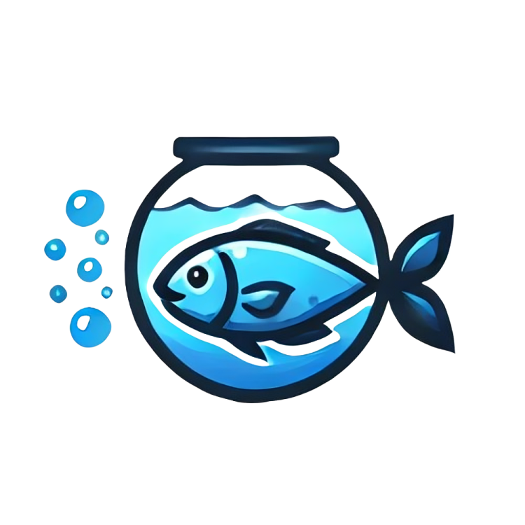

# Aquário

[](CHANGELOG.md)
[](LICENSE)

> **👨‍💻 Developers**: See [README-DEV.md](README-DEV.md) for technical setup | [CHANGELOG](CHANGELOG.md)



## About

**Aquário** is an open-source platform for students, professors, and labs at the Centro de Informática (CI) of UFPB. It centralizes academic information and facilitates communication within the community.

## Features

### 📚 Guides (Guias)

Course-specific guides for students - curricular structure, tips, and resources.

### 🔬 Entities (Entidades)

Directory of labs, research groups, and student organizations at CI.

### 📍 Maps

Interactive maps of campus buildings and rooms.

### 💼 Opportunities (Vagas)

Job listings, internships, research positions, and volunteer opportunities.

## Tech Stack

- **Framework**: Next.js 14 (App Router)
- **Language**: TypeScript
- **Styling**: Tailwind CSS + shadcn/ui
- **Database**: PostgreSQL + Prisma
- **Testing**: Jest + Vitest + Playwright

## Quick Start

**Prerequisites:**
- Node.js 18+ and npm installed ([Download Node.js](https://nodejs.org/))

```bash
git clone https://github.com/aquario-ufpb/aquario.git
cd aquario
npm install
cp .env.example .env
npm run setup
npm run dev
```

See [README-DEV.md](README-DEV.md) for complete setup instructions.

## Contributing

Contributions are welcome! See [CONTRIBUTING.md](CONTRIBUTING.md) for guidelines.

1. Fork the repository
2. Create a feature branch: `git checkout -b feature/my-feature`
3. Make your changes
4. Submit a Pull Request

## Contributors


<div align="top">
  
  
</div>

## License

This project is licensed under the [MIT License](LICENSE).

The source code can be freely copied, modified, and redistributed, as long as the copyright notice and license text are maintained.

However, the **"Aquário" name**, **logo**, and other **brand elements are NOT covered** by this license. You may create forks or reuse the code under MIT terms, but **you may not use the "Aquário" name** or present derivative works as if they were the original project.

## Contact

- **Issues**: [GitHub Issues](https://github.com/aquario-ufpb/aquario/issues)
- **Email**: [aquarioufpb@gmail.com](mailto:aquarioufpb@gmail.com)
